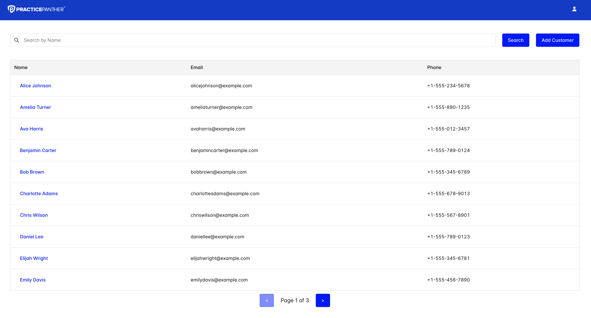
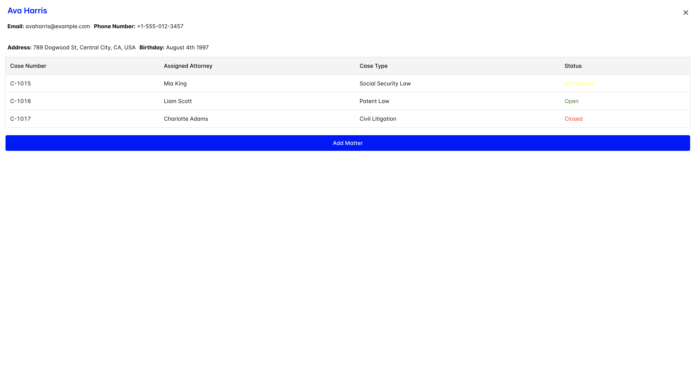
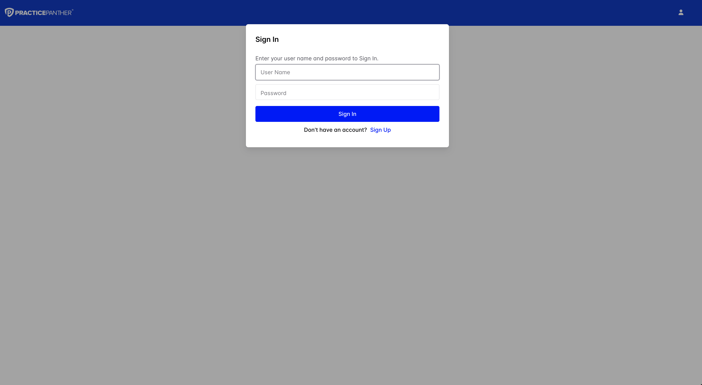
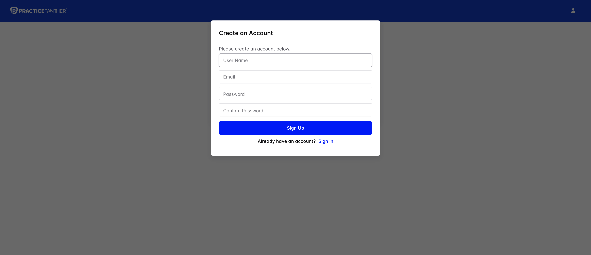

# Panther Project

## Local Run

To run this locally do the following steps
1. Set up docker locally. This will be needed to run the database
2. Run yarn in both the front-end and back-end folders
3. Navigate to the back-end folder
4. Run the `start-pgdb.sh` script
5. After complete, run the migrations ` yarn typeorm migration:run -d datasource.ts`
6. Run yarn start:dev
7. In a new termial window navigate to the front-end folder
8. Run `yarn vite`

The database has some customer data, but you will have to create your user to continue through the account creation feature.